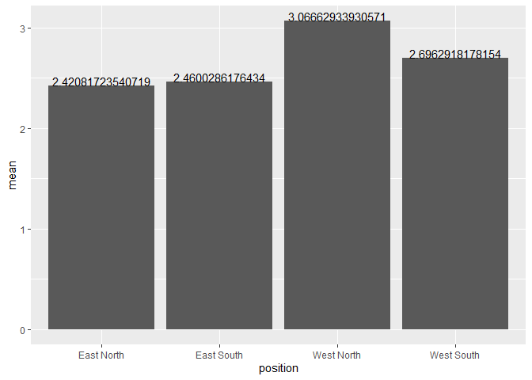
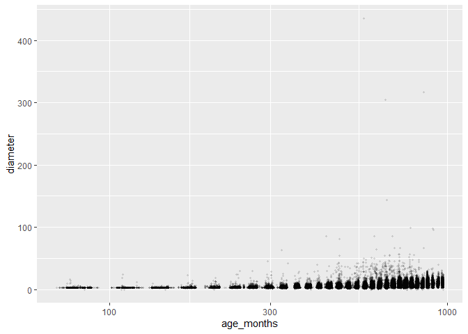
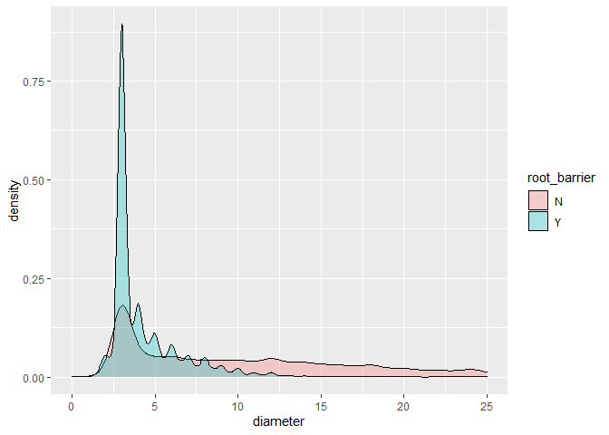

mini\_data\_analysis\_milestone\_2
================
Yicheng Wang
10/11/2021

# Mini Data Analysis Milestone 2

Before all, we need to load the two packages needed, where the dataset
of interest `vancouver_trees` is in. And we will print the first 6 rows
of the data for the manipulation and plotting latter.

``` r
library(datateachr) # <- might contain the data you picked!
library(tidyverse)
```

    ## -- Attaching packages --------------------------------------- tidyverse 1.3.1 --

    ## v ggplot2 3.3.5     v purrr   0.3.4
    ## v tibble  3.1.5     v dplyr   1.0.7
    ## v tidyr   1.1.4     v stringr 1.4.0
    ## v readr   2.0.2     v forcats 0.5.1

    ## -- Conflicts ------------------------------------------ tidyverse_conflicts() --
    ## x dplyr::filter() masks stats::filter()
    ## x dplyr::lag()    masks stats::lag()

``` r
library(psych)
```

    ## 
    ## Attaching package: 'psych'

    ## The following objects are masked from 'package:ggplot2':
    ## 
    ##     %+%, alpha

``` r
print(head(vancouver_trees))
```

    ## # A tibble: 6 x 20
    ##   tree_id civic_number std_street genus_name species_name cultivar_name  
    ##     <dbl>        <dbl> <chr>      <chr>      <chr>        <chr>          
    ## 1  149556          494 W 58TH AV  ULMUS      AMERICANA    BRANDON        
    ## 2  149563          450 W 58TH AV  ZELKOVA    SERRATA      <NA>           
    ## 3  149579         4994 WINDSOR ST STYRAX     JAPONICA     <NA>           
    ## 4  149590          858 E 39TH AV  FRAXINUS   AMERICANA    AUTUMN APPLAUSE
    ## 5  149604         5032 WINDSOR ST ACER       CAMPESTRE    <NA>           
    ## 6  149616          585 W 61ST AV  PYRUS      CALLERYANA   CHANTICLEER    
    ## # ... with 14 more variables: common_name <chr>, assigned <chr>,
    ## #   root_barrier <chr>, plant_area <chr>, on_street_block <dbl>,
    ## #   on_street <chr>, neighbourhood_name <chr>, street_side_name <chr>,
    ## #   height_range_id <dbl>, diameter <dbl>, curb <chr>, date_planted <date>,
    ## #   longitude <dbl>, latitude <dbl>

## 1. Process and Summarize data

### 1.1 Review of 4 Research Problems

1.  Are the parameters of the tree like diameter equally distributed
    among different species?  
2.  Will some species of trees concentrate on some places? Or are the
    trees equally distributed among the map?
3.  What is the relationship between the age of trees and their diameter
    or other parameter?
4.  What is effect of root barrier on the growth of trees(their
    diameter)?

### 1.2 Graph and Summarize

For the 1st problem, the first thing comes to my mind is that we can
take a look at how many data points fall into each species. It is
important to know about this because some minority species with one or
two records may not have much value to study on it. We want to focus on
the several majority species.

``` r
subset_1 <- vancouver_trees%>%
  group_by(species_name)%>%
  summarise(number_of_records=n())%>%
  arrange(desc(number_of_records))

print(subset_1[1:10,])
```

    ## # A tibble: 10 x 2
    ##    species_name number_of_records
    ##    <chr>                    <int>
    ##  1 SERRULATA                13357
    ##  2 CERASIFERA               12031
    ##  3 PLATANOIDES              11963
    ##  4 RUBRUM                    8467
    ##  5 AMERICANA                 5515
    ##  6 SYLVATICA                 5285
    ##  7 BETULUS                   5195
    ##  8 EUCHLORA   X              4427
    ##  9 FREEMANI   X              4164
    ## 10 CAMPESTRE                 3477

Next, we center our focus on the top 10 species. To better see the
difference between diameter distribution among species, let’s draw the
density graphs of the 10 species.

``` r
  subset_1=subset_1[1:10,] #choose top 10 species 
  print(subset_1)
```

    ## # A tibble: 10 x 2
    ##    species_name number_of_records
    ##    <chr>                    <int>
    ##  1 SERRULATA                13357
    ##  2 CERASIFERA               12031
    ##  3 PLATANOIDES              11963
    ##  4 RUBRUM                    8467
    ##  5 AMERICANA                 5515
    ##  6 SYLVATICA                 5285
    ##  7 BETULUS                   5195
    ##  8 EUCHLORA   X              4427
    ##  9 FREEMANI   X              4164
    ## 10 CAMPESTRE                 3477

``` r
  plot_1=filter( vancouver_trees, species_name %in% subset_1$species_name) %>% 
            ggplot(aes(diameter,species_name)) +
            ggridges::geom_density_ridges()
  print(plot_1)
```

    ## Picking joint bandwidth of 1.05

<!-- -->

For the second research problem, we first find the medians of both the
latitude and the latitude of trees. And we divide the area trees stand
into 4 regions according to the medians of the latitudes and the
latitudes: West North, East North, West South and East South. Then, we
calculate the summary statistics of `height_range_id` among different
regions/positions.

``` r
  med_position<-apply(na.omit(vancouver_trees[,c("longitude","latitude")]),2,median) # find the medians of the longitude and latitude to classify trees into different p
  table_with_position <-vancouver_trees %>% 
     mutate(position = case_when( (longitude< med_position[1]) & (latitude<med_position[2])  ~ "West South",  
                                  (longitude< med_position[1]) & (latitude>=med_position[2])  ~ "West North",
                                  (longitude>= med_position[1]) & (latitude<med_position[2])  ~ "East South",
                                 TRUE ~ "East North"))
  #calculate the summary statistics 
  summary=table_with_position%>%
            group_by(position)%>%
            do(describe(.$height_range_id))
  print(summary)
```

    ## # A tibble: 4 x 14
    ## # Groups:   position [4]
    ##   position   vars     n  mean    sd median trimmed   mad   min   max range  skew
    ##   <chr>     <dbl> <dbl> <dbl> <dbl>  <dbl>   <dbl> <dbl> <dbl> <dbl> <dbl> <dbl>
    ## 1 East Nor~     1 52543  2.42  1.44      2    2.23  1.48     0    10    10 1.05 
    ## 2 East Sou~     1 32148  2.46  1.28      2    2.35  1.48     0    10    10 0.822
    ## 3 West Nor~     1 32148  3.07  1.74      3    2.89  1.48     0    10    10 0.743
    ## 4 West Sou~     1 29772  2.70  1.64      2    2.47  1.48     0    10    10 1.11 
    ## # ... with 2 more variables: kurtosis <dbl>, se <dbl>

Then, we plot the mean of the trees’ diameter among each region. It
seems that the trees in the West North region tend to be higher than
those in the other 3 regions.

``` r
  ggplot(summary,aes(position,mean))+
    geom_col()+ #first  geom layer
    geom_text(aes(label=mean),position=position_dodge(0.9),vjust=0) #second geom layer
```

<!-- -->

For the third research problem, the ages of trees should be calculated
first to form a new column. Since the variable `heights_range_id` take
the level 1-10 to indicate the height of the trees, we can use it as
categorical variables to see if summarized statistics of ages like the
mean and median are different among trees of different height level. So,
we create a table to compute the median, range, mean and standard
deviation of ages(by months) among different height levels.

``` r
  vancouver_trees <- table_with_position
  #create a new column caculating the ages of trees in months
  vancouver_trees$age_months=as.numeric(difftime(Sys.Date(),vancouver_trees$date_planted,units="days")/12)
  vancouver_trees%>%
    group_by(height_range_id)%>%
    summarise(age_mean_months=mean(age_months,na.rm=TRUE),
              age_range_months=max(age_months,na.rm=TRUE)-min(age_months,na.rm=TRUE),
              age_median_months=median(age_months,na.rm=TRUE),
              age_std_months=sd(age_months,na.rm=TRUE))
```

    ## # A tibble: 11 x 5
    ##    height_range_id age_mean_months age_range_months age_median_months
    ##              <dbl>           <dbl>            <dbl>             <dbl>
    ##  1               0            386.             888.              353.
    ##  2               1            372.             901.              358.
    ##  3               2            678.             900.              697.
    ##  4               3            715.             891.              724.
    ##  5               4            744.             897.              754.
    ##  6               5            758.             880.              761.
    ##  7               6            712.             863.              723.
    ##  8               7            652.             629.              654.
    ##  9               8            616.             415.              618.
    ## 10               9            626.             310.              648.
    ## 11              10            724.               0               724.
    ## # ... with 1 more variable: age_std_months <dbl>

Next, let’s plot the relationship between trees’ ages and their
diameters. Since the points will expand too much on the x-axis, log
scale on x-axis is adopted.

``` r
  ggplot(vancouver_trees, aes(age_months,diameter))+
           geom_point(size=0.8, alpha =0.1)+
           scale_x_log10()
```

    ## Warning: Removed 76548 rows containing missing values (geom_point).

<!-- -->

For the forth research problem, we consider to compute the the median,
range, mean and standard deviation of diameters among trees with and
without root barriers. The two groups show great difference in the mean
and median.

``` r
  table_summary<-group_by(vancouver_trees, root_barrier ) %>%
    do(describe(.$diameter))
  print(table_summary)
```

    ## # A tibble: 2 x 14
    ## # Groups:   root_barrier [2]
    ##   root_barrier  vars      n  mean    sd median trimmed   mad   min   max range
    ##   <chr>        <dbl>  <dbl> <dbl> <dbl>  <dbl>   <dbl> <dbl> <dbl> <dbl> <dbl>
    ## 1 N                1 137455 12.0   9.29     10   10.7  9.64    0     435 435  
    ## 2 Y                1   9156  4.40  3.00      3    3.86 0.741   0.5    86  85.5
    ## # ... with 3 more variables: skew <dbl>, kurtosis <dbl>, se <dbl>

Then, two density plots are explicitly separated in the same graph by
setting the transparency parameter `alpha`.It seems that the
distribution of trees with root barrier has a sharp spike while trees
without root barriers are distributed more equally.

``` r
  ggplot(vancouver_trees, aes(x = diameter)) + 
    geom_density(aes(fill = root_barrier), alpha=0.3 )+
    xlim(0, 25)
```

    ## Warning: Removed 13438 rows containing non-finite values (stat_density).

<!-- -->

#### Summary

1.  The answer to the first research problem can be clearly seen from
    the graph: Top 10 trees species have different distributions in
    their diameters. But “distributed differently or not” is just a very
    general question. Maybe we can refine the origin question to “Is
    there any way to distinct the species by using the diameter and
    other parameter?”.  
2.  The second question has not been answered very clearly because our
    partition of the whole Vancouver region is very rough. We can not
    see very significant difference in the plot. I think this question
    can be kept doing further research with the refined way to show
    trees’ position in the graph.  
3.  The scatterplot shed some light on the Question 3. Basically, we can
    say the trees’ diameters increase with their ages. We can go further
    by changing the question 3 to “Do the ages and diameters of trees
    have linear relationship?”.  
4.  For the 4th research problem, the density plot shows the difference
    between the tree diameter with and without root barriers. It is
    clear that the diameters of trees with barrier tend to center on 3.
    And the trees without barrier have more freedom in their diameters
    with a much higher mean–10. They can grow wildly. Still, we will ask
    further: “Is it possible to tell apart the trees with and without
    root barriers by using their diameter data?”

## Tidy data

### 2.1 Tidy or Not

I think the data is tidy because each row is an observation, each column
is a variable and each cell is a value. Let’s take a look at the current
data before we untidy it. We will reorder the columns for convenience to
show the difference of the data before and after.

``` r
  select(vancouver_trees, tree_id, diameter, root_barrier, everything()) 
```

    ## # A tibble: 146,611 x 22
    ##    tree_id diameter root_barrier civic_number std_street genus_name species_name
    ##      <dbl>    <dbl> <chr>               <dbl> <chr>      <chr>      <chr>       
    ##  1  149556     10   N                     494 W 58TH AV  ULMUS      AMERICANA   
    ##  2  149563     10   N                     450 W 58TH AV  ZELKOVA    SERRATA     
    ##  3  149579      4   N                    4994 WINDSOR ST STYRAX     JAPONICA    
    ##  4  149590     18   N                     858 E 39TH AV  FRAXINUS   AMERICANA   
    ##  5  149604      9   N                    5032 WINDSOR ST ACER       CAMPESTRE   
    ##  6  149616      5   N                     585 W 61ST AV  PYRUS      CALLERYANA  
    ##  7  149617     15   N                    4909 SHERBROOK~ ACER       PLATANOIDES 
    ##  8  149618     14   N                    4925 SHERBROOK~ ACER       PLATANOIDES 
    ##  9  149619     16   N                    4969 SHERBROOK~ ACER       PLATANOIDES 
    ## 10  149625      7.5 N                     720 E 39TH AV  FRAXINUS   AMERICANA   
    ## # ... with 146,601 more rows, and 15 more variables: cultivar_name <chr>,
    ## #   common_name <chr>, assigned <chr>, plant_area <chr>, on_street_block <dbl>,
    ## #   on_street <chr>, neighbourhood_name <chr>, street_side_name <chr>,
    ## #   height_range_id <dbl>, curb <chr>, date_planted <date>, longitude <dbl>,
    ## #   latitude <dbl>, position <chr>, age_months <dbl>

### 2.2 Untidy and then tidy

First, untidy the tidy data. since `root_barrier` takes binary
values–“Y” and “N”, we use it to create the two new columns by taking
diameter as their values. Then, each row has two values: one filled with
its diameter value and the other taking `NA` according to whether the
tree has root barrier or not. For example, trees with root barriers fill
`root_barrier_Y` column with their diameters and `root_barrier_N`
columns with `NA`. If we want to study the forth problem, i.e, the
relationship between root barrier and diameters, each row of the
transformed data is not tidy. So, the data becomes untidy now.

``` r
  table_split<- vancouver_trees %>% 
                    pivot_wider(id_col=tree_id,
                                names_from=root_barrier,
                                values_from=diameter)

  #glue the two new columns to the original tibble

  table_untidy<- vancouver_trees %>%
             select(-diameter,-root_barrier)%>%
             mutate(root_barrier_N=table_split$N , root_barrier_Y=table_split$Y)%>%
             select(tree_id,root_barrier_N, root_barrier_Y, everything())
  print(table_untidy)
```

    ## # A tibble: 146,611 x 22
    ##    tree_id root_barrier_N root_barrier_Y civic_number std_street    genus_name
    ##      <dbl>          <dbl>          <dbl>        <dbl> <chr>         <chr>     
    ##  1  149556           10               NA          494 W 58TH AV     ULMUS     
    ##  2  149563           10               NA          450 W 58TH AV     ZELKOVA   
    ##  3  149579            4               NA         4994 WINDSOR ST    STYRAX    
    ##  4  149590           18               NA          858 E 39TH AV     FRAXINUS  
    ##  5  149604            9               NA         5032 WINDSOR ST    ACER      
    ##  6  149616            5               NA          585 W 61ST AV     PYRUS     
    ##  7  149617           15               NA         4909 SHERBROOKE ST ACER      
    ##  8  149618           14               NA         4925 SHERBROOKE ST ACER      
    ##  9  149619           16               NA         4969 SHERBROOKE ST ACER      
    ## 10  149625            7.5             NA          720 E 39TH AV     FRAXINUS  
    ## # ... with 146,601 more rows, and 16 more variables: species_name <chr>,
    ## #   cultivar_name <chr>, common_name <chr>, assigned <chr>, plant_area <chr>,
    ## #   on_street_block <dbl>, on_street <chr>, neighbourhood_name <chr>,
    ## #   street_side_name <chr>, height_range_id <dbl>, curb <chr>,
    ## #   date_planted <date>, longitude <dbl>, latitude <dbl>, position <chr>,
    ## #   age_months <dbl>

Next, we tidy it back to the original state. To study the effect of root
barriers on the diameters, we need to make the each row have two
values–their diameter and whether or not to have root barriers. We
reshape the data by `pivot_longer()`.

``` r
  table_tidy<-table_untidy %>% 
              pivot_longer(cols=c("root_barrier_N","root_barrier_Y"),
                           names_to="root_barrier",
                           values_to="diameter",
                           names_prefix = "root_barrier_",
                           values_drop_na = TRUE)%>%
              select(tree_id,root_barrier,diameter, everything())
  
  print(head(table_tidy))            
```

    ## # A tibble: 6 x 22
    ##   tree_id root_barrier diameter civic_number std_street genus_name species_name
    ##     <dbl> <chr>           <dbl>        <dbl> <chr>      <chr>      <chr>       
    ## 1  149556 N                  10          494 W 58TH AV  ULMUS      AMERICANA   
    ## 2  149563 N                  10          450 W 58TH AV  ZELKOVA    SERRATA     
    ## 3  149579 N                   4         4994 WINDSOR ST STYRAX     JAPONICA    
    ## 4  149590 N                  18          858 E 39TH AV  FRAXINUS   AMERICANA   
    ## 5  149604 N                   9         5032 WINDSOR ST ACER       CAMPESTRE   
    ## 6  149616 N                   5          585 W 61ST AV  PYRUS      CALLERYANA  
    ## # ... with 15 more variables: cultivar_name <chr>, common_name <chr>,
    ## #   assigned <chr>, plant_area <chr>, on_street_block <dbl>, on_street <chr>,
    ## #   neighbourhood_name <chr>, street_side_name <chr>, height_range_id <dbl>,
    ## #   curb <chr>, date_planted <date>, longitude <dbl>, latitude <dbl>,
    ## #   position <chr>, age_months <dbl>

### 2.3 Pick up 2 research questions and tranform data accordingly

I choose the following the second and forth research questions and make
a little bit modification of it:

-   Do some species of trees concentrate on some places? Or are the
    trees equally distributed among the map?
-   Do the ages and diameters of trees have linear relationship?

This is because the second research problem has not been answered
clearly, even without any clues. I really want to know the answer to the
question. And the modified version of problem 3 can shed some light on
the grow pattern as their ages increase. More coincidentally, it can be
seen from the plot that the linear relationship between trees’ age and
diameter become more evident with log axis adopted.It is really a magic
and I want to dive into it!  
Now we choose the version of data that best fits the two problems. So,
we first create one column to calculate `log(age)` and then filter out
the trees within minor species(they should be outliers). Next, the
columns relevant to the two research problems are selected. Finally, the
rows with `NA` are dropped out and the rest of the tibbles are
reordered.

``` r
  vancouver_trees <- vancouver_trees%>%
    mutate(log_age_months=log(age_months))%>%
    filter(species_name %in% (subset_1[subset_1$number_of_records >5,])$species_name)%>%
    select(tree_id, log_age_months, diameter, longitude, latitude)%>%
    drop_na()%>%
    arrange(log_age_months,desc(diameter))

  print(head(vancouver_trees))
```

    ## # A tibble: 6 x 5
    ##   tree_id log_age_months diameter longitude latitude
    ##     <dbl>          <dbl>    <dbl>     <dbl>    <dbl>
    ## 1  261089           4.30        3     -123.     49.2
    ## 2  260671           4.30        3     -123.     49.2
    ## 3  260952           4.31        3     -123.     49.2
    ## 4  257415           4.31        3     -123.     49.3
    ## 5  256894           4.31        3     -123.     49.3
    ## 6  261553           4.32        3     -123.     49.3
