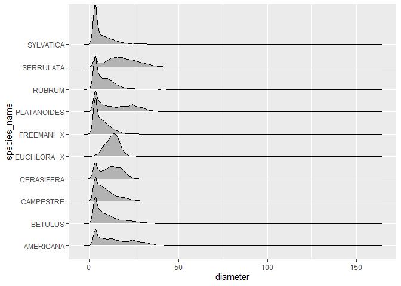
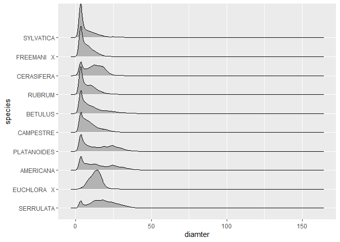

mini data analysis 3
================
Yicheng Wang
10/23/2021

# Mini Data Analysis- Milestone 3

Before all, we need to clear all the environment varibales in the
console left by the running of milestone 1 and milestone 2 and load the
two packages needed, where the dataset of interest `vancouver_trees` is
in. And we will print the first 6 rows to have a preview of what the
data look like.

``` r
 rm(list=ls()) 
library(datateachr) # <- might contain the data you picked!
library(tidyverse)
```

    ## -- Attaching packages --------------------------------------- tidyverse 1.3.1 --

    ## v ggplot2 3.3.5     v purrr   0.3.4
    ## v tibble  3.1.5     v dplyr   1.0.7
    ## v tidyr   1.1.4     v stringr 1.4.0
    ## v readr   2.0.2     v forcats 0.5.1

    ## -- Conflicts ------------------------------------------ tidyverse_conflicts() --
    ## x dplyr::filter() masks stats::filter()
    ## x dplyr::lag()    masks stats::lag()

``` r
library(psych)
```

    ## 
    ## Attaching package: 'psych'

    ## The following objects are masked from 'package:ggplot2':
    ## 
    ##     %+%, alpha

``` r
library(lubridate)
```

    ## 
    ## Attaching package: 'lubridate'

    ## The following objects are masked from 'package:base':
    ## 
    ##     date, intersect, setdiff, union

``` r
library(here)
```

    ## here() starts at D:/mda-WYC401

``` r
print(head(vancouver_trees))
```

    ## # A tibble: 6 x 20
    ##   tree_id civic_number std_street genus_name species_name cultivar_name  
    ##     <dbl>        <dbl> <chr>      <chr>      <chr>        <chr>          
    ## 1  149556          494 W 58TH AV  ULMUS      AMERICANA    BRANDON        
    ## 2  149563          450 W 58TH AV  ZELKOVA    SERRATA      <NA>           
    ## 3  149579         4994 WINDSOR ST STYRAX     JAPONICA     <NA>           
    ## 4  149590          858 E 39TH AV  FRAXINUS   AMERICANA    AUTUMN APPLAUSE
    ## 5  149604         5032 WINDSOR ST ACER       CAMPESTRE    <NA>           
    ## 6  149616          585 W 61ST AV  PYRUS      CALLERYANA   CHANTICLEER    
    ## # ... with 14 more variables: common_name <chr>, assigned <chr>,
    ## #   root_barrier <chr>, plant_area <chr>, on_street_block <dbl>,
    ## #   on_street <chr>, neighbourhood_name <chr>, street_side_name <chr>,
    ## #   height_range_id <dbl>, diameter <dbl>, curb <chr>, date_planted <date>,
    ## #   longitude <dbl>, latitude <dbl>

Recall that 2 research problems are chosen in the milestone 2. They
are:  
1. Do some species of trees concentrate on some places? Or are the trees
equally distributed among the map?  
2. What is effect of root barrier on the growth of trees(their
diameter)?

## 1. Create New Factors and Time Based Columns

In this part, two tasks are done:

-   Task 1
-   Task 3

### 1.1.Reorder Graph

In the milestone 2, a ridge plot is done to show the different
distributions of trees’ diameter among different species. We bring it
here again.

``` r
  subset_1 <- vancouver_trees%>%
  group_by(species_name)%>%
  summarise(number_of_records=n())%>%
  arrange(desc(number_of_records))


  plot_1=filter( vancouver_trees, species_name %in% subset_1[1:10,]$species_name) %>% 
            ggplot(aes(diameter,species_name)) +
            ggridges::geom_density_ridges()
  print(plot_1)
```

    ## Picking joint bandwidth of 1.05

<!-- -->

But the order of `species_name` in y-axis does not make the plot very
beautiful and clear. So, we consider to reorder it. The species names
are arranged in the new plot by their peak points in the density from
left to the right. Choosing the peak points in separate density plots is
because the peak point is often the position where most data points
concentrate. Moreover, the peak points increasing from the top subplots
to the bottom makes the plot tidier. To do this, a function detecting
the peak point in the density point is defined and applied to the
`group_by()` by `group_map()`. Then, a new tibble `dataframe_peak_point`
is created to store the peak points corresponding to their species and
arranged based on the peak points. In `ggplot()`, the new order of the
species names is passed to `fct_relevel()`function for new plotting.

``` r
  #This function 
  find_peak_point<-function(col){
    index=which.max(density(col)$y)
    return (density(col)$x[index])
  }
  
  vancouver_trees_top_10_species<- filter(vancouver_trees,species_name %in% (subset_1[1:10,])$species_name)
  vancouver_trees_top_10_species$species_name<-as.factor(vancouver_trees_top_10_species$species_name)
  density_peak_points<-vancouver_trees_top_10_species%>%
                        group_by(species_name)%>%
                        group_map(~find_peak_point(.x$diameter))%>%
                        as.numeric()
  
  dataframe_peak_point<-data.frame(levels(vancouver_trees_top_10_species$species_name),density_peak_points)%>%
                           tibble()%>%
                           arrange(desc(density_peak_points))
  print(dataframe_peak_point)
```

    ## # A tibble: 10 x 2
    ##    levels.vancouver_trees_top_10_species.species_name. density_peak_points
    ##    <chr>                                                             <dbl>
    ##  1 SERRULATA                                                         17.8 
    ##  2 EUCHLORA   X                                                      14.1 
    ##  3 AMERICANA                                                          3.89
    ##  4 PLATANOIDES                                                        3.43
    ##  5 CAMPESTRE                                                          3.31
    ##  6 BETULUS                                                            3.30
    ##  7 RUBRUM                                                             3.29
    ##  8 CERASIFERA                                                         3.14
    ##  9 FREEMANI   X                                                       3.13
    ## 10 SYLVATICA                                                          3.06

``` r
  #use fct_level() to change the level of the factors
  plot_2<-ggplot(vancouver_trees_top_10_species,aes(x=diameter,y=fct_relevel( species_name,dataframe_peak_point[[1]])))+ 
    ggridges::geom_density_ridges()+
    labs(x="diamter",y="species")
  print(plot_2)
```

    ## Picking joint bandwidth of 1.05

<!-- -->

### 1.2 Date Transformation

To see how the trees are distributed among the months of their
birthdays, we try to use `lubridate` packages to extract the months when
the trees are planted. In the data, the column `date_planted` represents
the dates of trees being planted. We use `month()` to create a new
column in tibbles indicating which month the trees are planted in.

``` r
  #select necessary columns for clear demonstration

  vancouver_trees_reduced<-select(vancouver_trees,date_planted,diameter)
  vancouver_trees_month<-vancouver_trees_reduced %>% 
    mutate(month_planted=month(date_planted,label=TRUE))%>%
    drop_na()
  print(vancouver_trees_month)
```

    ## # A tibble: 70,063 x 3
    ##    date_planted diameter month_planted
    ##    <date>          <dbl> <ord>        
    ##  1 1999-01-13      10    Jan          
    ##  2 1996-05-31      10    May          
    ##  3 1993-11-22       4    Nov          
    ##  4 1996-04-29      18    Apr          
    ##  5 1993-12-17       9    Dec          
    ##  6 1993-12-16      15    Dec          
    ##  7 1993-12-16      14    Dec          
    ##  8 1993-12-16      16    Dec          
    ##  9 1993-12-03       7.5  Dec          
    ## 10 1993-12-03       7.75 Dec          
    ## # ... with 70,053 more rows

``` r
  plot_3<-vancouver_trees_month%>%
           ggplot(aes(month_planted))+
           geom_bar()
  print(plot_3)
```

<!-- -->

Investigating the months when trees are planted might be insightful
because some months of a year may not be suitable for planing trees. And
a bar plot is drawn to show the number of trees being planted in the 12
months. We can see that very few trees are planted from May to
September. I guess that the period may not be a good time for planted
trees to survive.

## 2. Modelling

I choose the following research questions and the variable of
interest.  
Research Problem: What is effect of root barriers on the growth of
trees’ diameter?  
Variable of Interest: root\_barrier

One way to test if root barriers have some effect on the trees’ growth
is to use t-test to test if there is significant difference between the
diameter mean of tree group with and without root barriers. `t.test()`
is used to test if the diameter mean of two groups are different. Then,
the results like p-value and estimated mean are stored into a tibble by
`broom::glance()`.

``` r
  diameter_1<-filter(vancouver_trees,root_barrier=="Y")%>%
              select(diameter)
  diameter_2<-filter(vancouver_trees,root_barrier=="N")%>%
              select(diameter)

  r<-t.test(diameter_1,diameter_2)
  print(r)
```

    ## 
    ##  Welch Two Sample t-test
    ## 
    ## data:  diameter_1 and diameter_2
    ## t = -188.48, df = 23961, p-value < 2.2e-16
    ## alternative hypothesis: true difference in means is not equal to 0
    ## 95 percent confidence interval:
    ##  -7.640679 -7.483398
    ## sample estimates:
    ## mean of x mean of y 
    ##   4.40038  11.96242

``` r
  result<-broom::glance(r)
  print(result)
```

    ## # A tibble: 1 x 10
    ##   estimate estimate1 estimate2 statistic p.value parameter conf.low conf.high
    ##      <dbl>     <dbl>     <dbl>     <dbl>   <dbl>     <dbl>    <dbl>     <dbl>
    ## 1    -7.56      4.40      12.0     -188.       0    23961.    -7.64     -7.48
    ## # ... with 2 more variables: method <chr>, alternative <chr>

## 3.Read and write data

We save the result by t-test into csv file and rds file under the
`output directory`. To test if we store the file successfully,
`readRDS()` is used to read the file just stored.

``` r
write_csv(result,here::here("output","t_test_result.csv"))

saveRDS(result,file=here::here("output","t_test_result.rds"))
d<-readRDS(here::here("output","t_test_result.rds"))
print(d)
```

    ## # A tibble: 1 x 10
    ##   estimate estimate1 estimate2 statistic p.value parameter conf.low conf.high
    ##      <dbl>     <dbl>     <dbl>     <dbl>   <dbl>     <dbl>    <dbl>     <dbl>
    ## 1    -7.56      4.40      12.0     -188.       0    23961.    -7.64     -7.48
    ## # ... with 2 more variables: method <chr>, alternative <chr>
