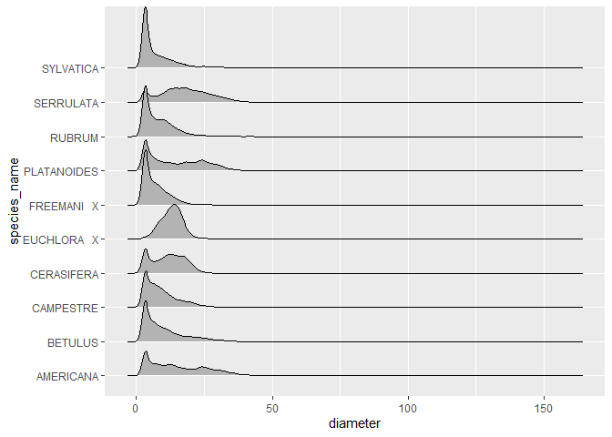
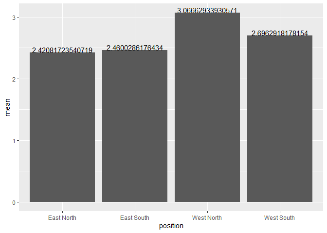
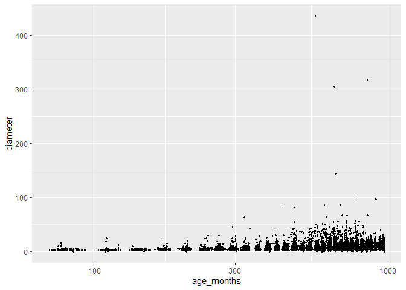
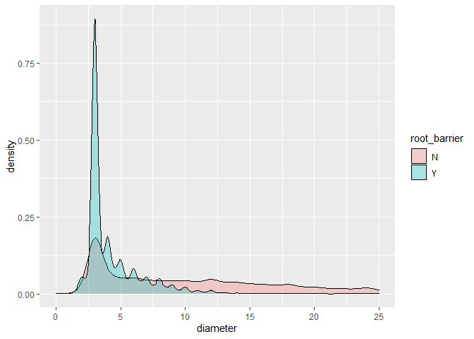

mini\_data\_analysis\_milestone\_2
================
Yicheng Wang
10/11/2021

# Mini Data Analysis Milestone 2

Before all, we need to load the two packages needed, where the dataset
of interest vancouver\_trees is in. And we will print the first 6 rows
of the data for the manipulation and plotting latter.

``` r
library(datateachr) # <- might contain the data you picked!
library(tidyverse)
```

    ## -- Attaching packages --------------------------------------- tidyverse 1.3.1 --

    ## v ggplot2 3.3.5     v purrr   0.3.4
    ## v tibble  3.1.5     v dplyr   1.0.7
    ## v tidyr   1.1.4     v stringr 1.4.0
    ## v readr   2.0.2     v forcats 0.5.1

    ## -- Conflicts ------------------------------------------ tidyverse_conflicts() --
    ## x dplyr::filter() masks stats::filter()
    ## x dplyr::lag()    masks stats::lag()

``` r
library(psych)
```

    ## 
    ## Attaching package: 'psych'

    ## The following objects are masked from 'package:ggplot2':
    ## 
    ##     %+%, alpha

``` r
print(head(vancouver_trees))
```

    ## # A tibble: 6 x 20
    ##   tree_id civic_number std_street genus_name species_name cultivar_name  
    ##     <dbl>        <dbl> <chr>      <chr>      <chr>        <chr>          
    ## 1  149556          494 W 58TH AV  ULMUS      AMERICANA    BRANDON        
    ## 2  149563          450 W 58TH AV  ZELKOVA    SERRATA      <NA>           
    ## 3  149579         4994 WINDSOR ST STYRAX     JAPONICA     <NA>           
    ## 4  149590          858 E 39TH AV  FRAXINUS   AMERICANA    AUTUMN APPLAUSE
    ## 5  149604         5032 WINDSOR ST ACER       CAMPESTRE    <NA>           
    ## 6  149616          585 W 61ST AV  PYRUS      CALLERYANA   CHANTICLEER    
    ## # ... with 14 more variables: common_name <chr>, assigned <chr>,
    ## #   root_barrier <chr>, plant_area <chr>, on_street_block <dbl>,
    ## #   on_street <chr>, neighbourhood_name <chr>, street_side_name <chr>,
    ## #   height_range_id <dbl>, diameter <dbl>, curb <chr>, date_planted <date>,
    ## #   longitude <dbl>, latitude <dbl>

## 1. Process and Summarize data

### 1.1 Review of 4 Research Problems

1.  Are the parameters of the tree like diameter equally distributed
    among different species?
2.  Do some species of trees concentrate on some places? Or are the
    trees equally distributed among the map?
3.  What is the relationship between the age of trees and their diameter
    or other parameter?
4.  What is effect of root barrier on the growth of trees(their
    diameter)?

### 1.2 Graph and Summarize

For the 1st problem, the first thing comes to my mind is that we can
take a look at how many data points falls into each species. It is
important to know about this because some minority species with one or
two record may not have much value to study on it. We want to focus on
the serveral majority species.

``` r
subset_1 <- vancouver_trees%>%
  group_by(species_name)%>%
  summarise(number_of_records=n())%>%
  arrange(desc(number_of_records))

print(subset_1[1:10,])
```

    ## # A tibble: 10 x 2
    ##    species_name number_of_records
    ##    <chr>                    <int>
    ##  1 SERRULATA                13357
    ##  2 CERASIFERA               12031
    ##  3 PLATANOIDES              11963
    ##  4 RUBRUM                    8467
    ##  5 AMERICANA                 5515
    ##  6 SYLVATICA                 5285
    ##  7 BETULUS                   5195
    ##  8 EUCHLORA   X              4427
    ##  9 FREEMANI   X              4164
    ## 10 CAMPESTRE                 3477

Next, we center our focus on the top 10 species. To better see the
difference between diameter distribution among species, let’s draw the
density graphs of the 10 species.

``` r
  subset_1=subset_1[1:10,]
  print(subset_1)
```

    ## # A tibble: 10 x 2
    ##    species_name number_of_records
    ##    <chr>                    <int>
    ##  1 SERRULATA                13357
    ##  2 CERASIFERA               12031
    ##  3 PLATANOIDES              11963
    ##  4 RUBRUM                    8467
    ##  5 AMERICANA                 5515
    ##  6 SYLVATICA                 5285
    ##  7 BETULUS                   5195
    ##  8 EUCHLORA   X              4427
    ##  9 FREEMANI   X              4164
    ## 10 CAMPESTRE                 3477

``` r
  plot_1=filter( vancouver_trees, species_name %in% subset_1$species_name) %>% 
  ggplot(aes(diameter,species_name)) +
  ggridges::geom_density_ridges()
  print(plot_1)
```

    ## Picking joint bandwidth of 1.05

<!-- -->

For the second research problem, we first find the medians of both the
latitude and the latitude of trees. And we divide the area trees stand
into 4 regions according to the medians of the latitudes and the
latitudes: West North, East North, West South and East South. Then, we
caculate the summary statistics of `height_range_id` among different
regions/positions.

``` r
  med_position<-apply(na.omit(vancouver_trees[,c("longitude","latitude")]),2,median)
  table_with_position <-vancouver_trees %>% 
     mutate(position = case_when( (longitude< med_position[1]) & (latitude<med_position[2])  ~ "West South",  
                                  (longitude< med_position[1]) & (latitude>=med_position[2])  ~ "West North",
                                (longitude>= med_position[1]) & (latitude<med_position[2])  ~ "East South",
                                 TRUE ~ "East North"))
  summary=table_with_position%>%
            group_by(position)%>%
            do(describe(.$height_range_id))
  print(summary)
```

    ## # A tibble: 4 x 14
    ## # Groups:   position [4]
    ##   position   vars     n  mean    sd median trimmed   mad   min   max range  skew
    ##   <chr>     <dbl> <dbl> <dbl> <dbl>  <dbl>   <dbl> <dbl> <dbl> <dbl> <dbl> <dbl>
    ## 1 East Nor~     1 52543  2.42  1.44      2    2.23  1.48     0    10    10 1.05 
    ## 2 East Sou~     1 32148  2.46  1.28      2    2.35  1.48     0    10    10 0.822
    ## 3 West Nor~     1 32148  3.07  1.74      3    2.89  1.48     0    10    10 0.743
    ## 4 West Sou~     1 29772  2.70  1.64      2    2.47  1.48     0    10    10 1.11 
    ## # ... with 2 more variables: kurtosis <dbl>, se <dbl>

Then, we plot the mean of the trees’ diameter among each region. It
seems that the trees in the West North region tend to be higher than
those in the other 3 regions.

``` r
  ggplot(summary,aes(position,mean))+
    geom_col()+
    geom_text(aes(label=mean),position=position_dodge(0.9),vjust=0)
```

<!-- -->

For the third research problem, the age of trees should be calculated
first to form a new column.Since the variable `heights_range_id` take
the level 1-10 to indicate the height of the trees, we can use it as
categorical variables to see if summarized statistics of ages like mean
and median are different among trees of different height level. So, we
create a table to compute the median,range, mean and standard deviation
of ages(by months) among different height levels.

``` r
  vancouver_trees <- table_with_position
  #create a new column caculating the ages of trees in months
  vancouver_trees$age_months=as.numeric(difftime(Sys.Date(),vancouver_trees$date_planted,units="days")/12)
  vancouver_trees%>%
    group_by(height_range_id)%>%
    summarise(age_mean_months=mean(age_months,na.rm=TRUE),age_range_months=max(age_months,na.rm=TRUE)-min(age_months,na.rm=TRUE),age_median_months=median(age_months,na.rm=TRUE), age_std_months=sd(age_months,na.rm=TRUE))
```

    ## # A tibble: 11 x 5
    ##    height_range_id age_mean_months age_range_months age_median_months
    ##              <dbl>           <dbl>            <dbl>             <dbl>
    ##  1               0            386.             888.              353.
    ##  2               1            372.             901.              358.
    ##  3               2            678.             900.              697.
    ##  4               3            715.             891.              724.
    ##  5               4            744.             897.              754 
    ##  6               5            758.             880.              761.
    ##  7               6            712.             863.              723.
    ##  8               7            652.             629.              654.
    ##  9               8            616.             415.              618.
    ## 10               9            626.             310.              648.
    ## 11              10            724.               0               724.
    ## # ... with 1 more variable: age_std_months <dbl>

Next, let’s plot the relationship between trees’ age and their
diameters. Since the points will expand too much on the x-axis, log
scale on x-axis is adopted.

``` r
  ggplot(vancouver_trees, aes(age_months,diameter))+
           geom_point(size=0.8, alpha =1)+
           scale_x_log10()
```

    ## Warning: Removed 76548 rows containing missing values (geom_point).

<!-- -->

For the forth research problem, we consider to compute the the
median,range, mean and standard deviation of diameters among trees with
and without root barriers. The two group shows great difference in the
mean and median.

``` r
  table_summary<-group_by(vancouver_trees, root_barrier ) %>%
    do(describe(.$diameter))
  print(table_summary)
```

    ## # A tibble: 2 x 14
    ## # Groups:   root_barrier [2]
    ##   root_barrier  vars      n  mean    sd median trimmed   mad   min   max range
    ##   <chr>        <dbl>  <dbl> <dbl> <dbl>  <dbl>   <dbl> <dbl> <dbl> <dbl> <dbl>
    ## 1 N                1 137455 12.0   9.29     10   10.7  9.64    0     435 435  
    ## 2 Y                1   9156  4.40  3.00      3    3.86 0.741   0.5    86  85.5
    ## # ... with 3 more variables: skew <dbl>, kurtosis <dbl>, se <dbl>

Then, two density plots are drawn in the same graph by setting the
transparency parameter `alpha`.It seems that the distribution of trees
with root barrier has a sharp spike while trees without root barrier
distributed more equally.

``` r
  ggplot(vancouver_trees, aes(x = diameter)) + 
    geom_density(aes(fill = root_barrier), alpha=0.3 )+
    xlim(0, 25)
```

    ## Warning: Removed 13438 rows containing non-finite values (stat_density).

<!-- -->

#### Summary

1.  The answer to the first research problem can be clearly seen from
    the graph: Top 10 trees species have different distribution in their
    diameters. But “distributed differently or not” is just a very
    general question. Maybe we can refine the origin question to “Is
    there any way to distinct the species by using the diameter and
    other parameter?”.  
2.  The second question has not been answered very clearly because our
    partition of the whole vancouver region is very rough. I think this
    question can be kept doing further research with the refined way to
    show trees’ position in the graph.  
3.  The scatterplot shed some light on the Question 3. Basically, we can
    say the trees’ diameters increase with their ages. We can go further
    by chaging the question 3 to “Do the ages and diameters of trees
    have linear relationship?”.  
4.  For the 4th research problem, the density plot shows the difference
    between the tree diameter with root barriers and without. It is
    clear that the diameter of trees with barrier tend to center on 3.
    And the trees without barrier have more freedom in their diameters
    with a much higer mean–10. They can grow wildly. Still, we will ask
    further about if it is possible to tell apart the trees with and
    without root barriers by using their diameter data.

## Tidy data

### 2.1

I think the data is tidy because each row is an observation, each column
is a variable and each cell is a value. \#\#\# 2.2 Untidy and then tidy
